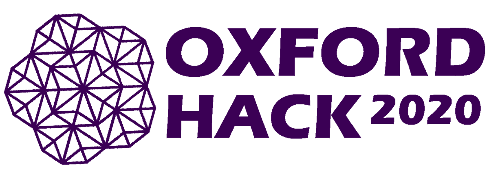

# Team sendCodes for Oxford Hack 2020

Official Entry of Team sendCodes, from SRM Institute of Science and Technology, Kattankulathur, India, to Oxford Hack 2020.  

 

## Links to Oxford Hack 2020 ⚓

- [Official Website](https://oxfordhack.co.uk/)
- [MLH](https://mlh.io/seasons/2021/events)
- [Code of Conduct](https://static.mlh.io/docs/mlh-code-of-conduct.pdf?fbclid=IwAR2vbP-bruJ_ZyL9D0bamJ-15OxadEtm0tv4l1EYBBkNnJ5-6XoUe0Zd2ZE)

## Problem Statement 🚧

***Missing Person Report and Search***

## Background 📖

India is home to more than 400 million children below the age of 18 years, and is considered one of the countries in which youth and children comprise more than 55% of the population. These missing children represent diverse cultures, religions, castes, communities, social and economic groups.

National Crime Records Bureau reported that one child goes missing every 8 minutes in India. It is found that over one lakh children go missing every year across our country.
Some 174 children go missing every day. Only about 50% of them are ever found again. But the story behind these statistics is complex. The NCRB also throws up some other startling figures such as that 1,11,569 children were missing for more than a year in 2016 and only about half of the missing children were found. Girls between 12 and 18 account for 66% of the 54,328 children reported as kidnapped in 2016.

Here's an incident that compelled us to come up with *Find My Human*;

When Meghana, 14, was rescued after eight months, she was already 22 weeks pregnant. It took a call from her, with a mobile phone she managed to lay her hands on, for the police to track her down to Chandpur in Uttar Pradesh. Meghana belongs to Kalyan in Maharashtra. She had been abducted by a 23-year-old, a regular customer at the eatery her father worked in. They used to chat and within days of their meeting, he had convinced her to come away with him. It isn’t clear if he had promised marriage. “He said he would enrol me in a good school,” says Meghana. The man imprisoned her in a house he shared with his extended family. “He hit me and raped me every day. He wouldn’t let me leave the house,” says Meghana. Meanwhile, her parents had filed a missing child complaint. They even told the police they suspected this man, but there was no headway.

Right now we have only added some statistics about children who go missing, when we add the number of adults who go missing as well, these statistics turn uglier.

**Find My Human aims at reuniting families by assisting in Search for the missing.**

## About Find My Human 🔧
### What
**Find My Human** is a Web Application that enables it's user to run a search for a missing Family Member. The User, assuming that they are already distressed, does not have to login and can file a report for a missing person. If a User finds someone who is lost, they can run a Search over the platform and try to find the best fit for the description that they enter as an input. We expand our Web Application to an Android App built using Kotlin for added

### Why
We do not really have platforms which allow people to run searches online or file reports of missing people as efficiently, the one's that we do are not at all User Friendly and only add on to the distress that family members face. With our platform **Find My Human**, we promise the users to offer better accessibilty, add language support for different regions and help them find their loved ones, as soon as possible.

### How
With a super simple User Interface and support for different languages, we make Reporting and Searching easy. Under the hood, we have a really elastically scalable system, deployed over Google Cloud Platform to handle traffic. We are using Firebase to store and export data and we have tried our level best to offer family members the smoothest experience. Currently, we are only offering support in our target country but in our future iterations we plan on expanding our services to different regions and take this idea forward, to help families find their loved ones as effortlessly as possible.

### Screenshots

## Installation and Execution

To checkout the Web Application simply head over [here](https://findmyhuman.online) or follow these steps.
   - Clone this repository.
   - Open index.html.
   - Make sure you have an active Internet Connection so the Web Application functions best (Chatbot and Database Access requires access to the Internet).

## Timeline ⏰

- Day 1: Checkpoints:
   - [x] Documentation
   - [ ] Set Up Front End
   - [ ] Create a Chatbot
   - [ ] Implement UI/UX Principles
   - [ ] Set Up Database using Firespace
   - [ ] Implement Form and Search
- Day 2: Checkpoints:
   - [ ] Integrate Front End and Back End
   - [ ] Deploy over Cloud
   - [ ] Run Checks

## Technology Principles Implemented 💡

1. Mobile First
2. Minimalist Design
3. Reusable
4. Well Documented
5. Open Source
6. Feasible
7. Scalable
8. Accessible To All

## Technology Stack 💻

- Google Cloud Platform
- HTML
- CSS
- JavaScript
- Bootstrap
- Firebase
- Google Dialog Flow
- Google Translate API
- Kommunicate
- Collect.chat
- Iconscout

## Nominations for Sponsor Challenges 🤝

 - Hack For a Good Cause
 - What the Hack?!
 - MLH Category Prizes
   - Best Domain Registered with Domain.com
   - Best use of Google Cloud

## Collaborators 🤖

No beep-bops, only developers.
| Name      | GitHub Profile     |
| :------------- | :----------: |
|  Aaishika S Bhattacharya /| Team Lead | [GitHub](https://www.github.com/aaishikasb)   |
|  Akash Ramjyothi   | [GitHub](https://www.github.com/akash-ramjyothi) |
|  Gyanesh Samanta   | [GitHub](https://www.github.com/gyanesh-samanta-123) |
|  Souharda Biswas   | [GitHub](https://www.github.com/TheSouharda) |

